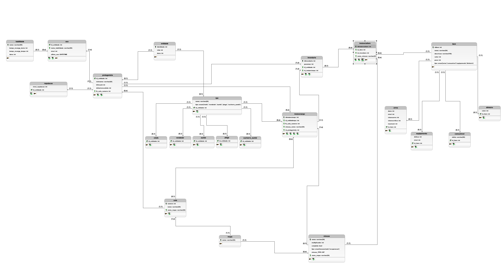

# DER

### Introdução
Diagrama lógico de dados (DLD) do projeto de SBD1, Resident Evil.

### Imagem do DLD

 | Versão |     Descrição      |                     Autor(es)                     |    Data    |
| :----: | :----------------: | :-----------------------------------------------: | :--------: |
|  1.0   | Criação | [José Oliveira](https://github.com/Jose1277) | 25/11/2024 |
|  1.1   | Alteração  | [José Oliveira](https://github.com/Jose1277) | 13/01/2025 |
|  1.2   | Alteração  | [José Oliveira](https://github.com/Jose1277) | 31/01/2025 |
