# DICIONÁRIO DE DADOS
### Descrição
Um dicionário de dados em um sistema de banco de dados é uma ferramenta essencial que armazena informações sobre a estrutura e os elementos do banco. Ele contém os metadados, ou seja, dados que descrevem as características dos dados armazenados.
 
### Tabelas

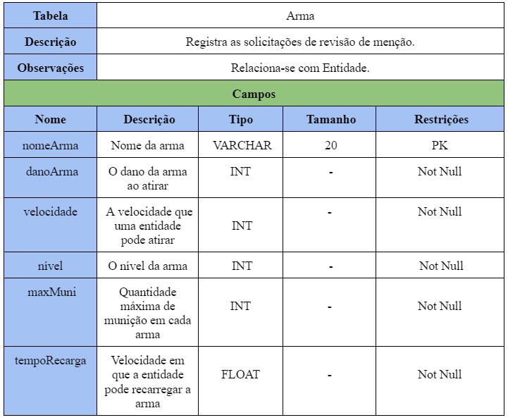
 
 
 
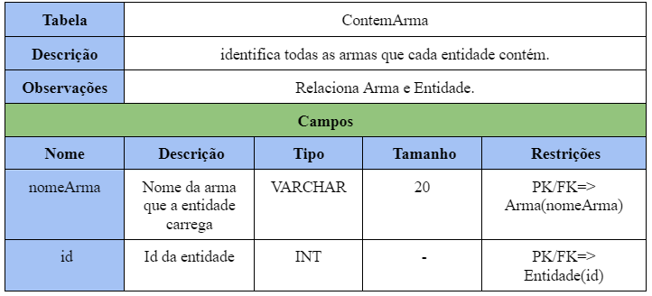
 
 
 
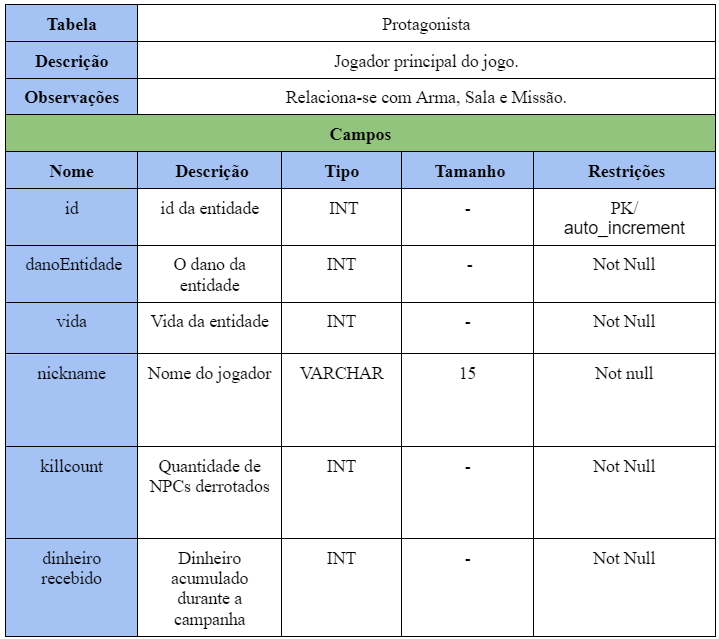
 
 
 
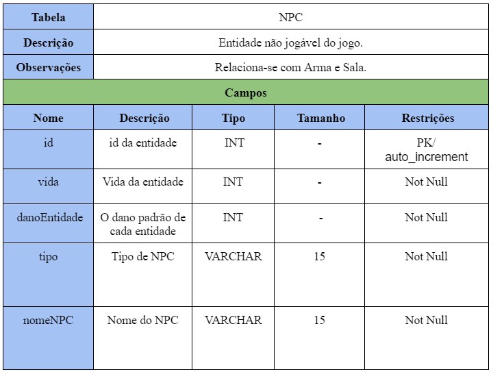
 
 
 
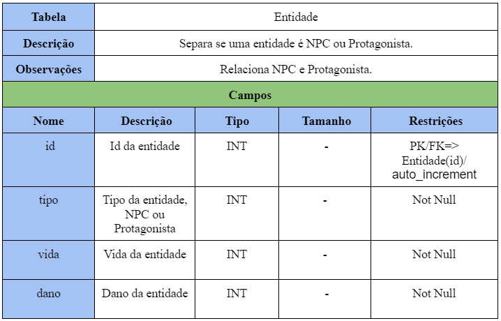
 
 
 
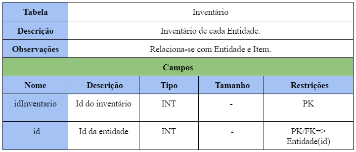
 
 
 

 
 
 

 
 
 
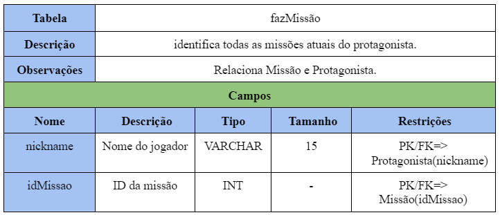
 
 
 
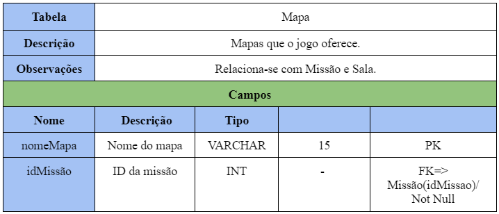
 
 
 
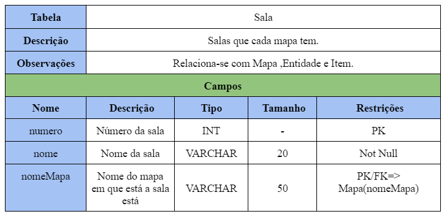
 
 
 

 
 
 
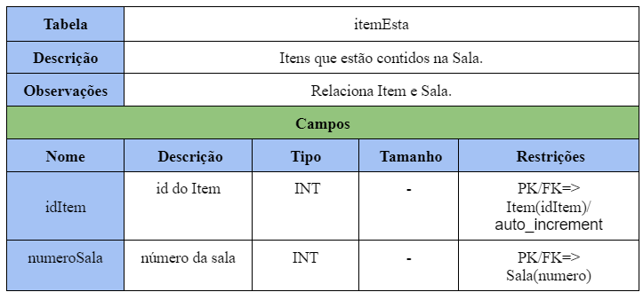
 
 
 
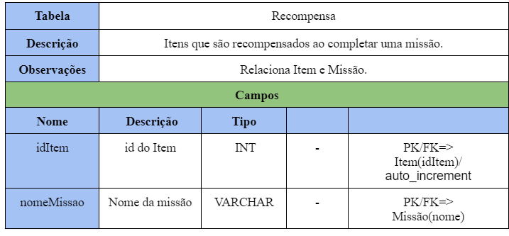

