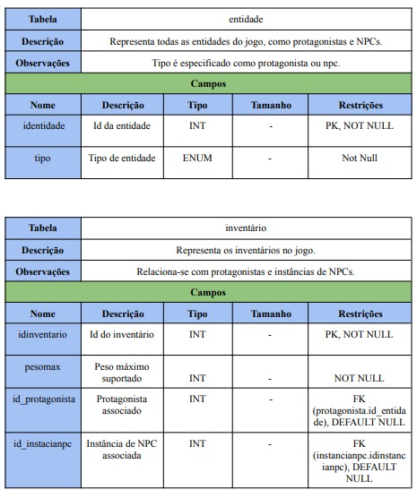

# DICIONÁRIO DE DADOS
### Descrição
Um dicionário de dados em um sistema de banco de dados é uma ferramenta essencial que armazena informações sobre a estrutura e os elementos do banco. Ele contém os metadados, ou seja, dados que descrevem as características dos dados armazenados.
 
### Tabelas

 
 
 

 
 
 

 
 
 

 
 
 

 
 
 

 
 
 

 
 
 

 
 
 

 
 
 

 
 
 

 
 
 

 
 
 

 
 
 

 
 
 

 
 
 

 
 
 

 
 
 

| Versão |     Descrição      |                     Autor(es)                     |    Data    |
| :----: | :----------------: | :-----------------------------------------------: | :--------: |
|  1.0   | Criação | [Anne de Capdeville](https://github.com/nanecapde) | 24/11/2024 |
|  1.1   | Atualização | [Anne de Capdeville](https://github.com/nanecapde) | 25/11/2024 |
|  1.2   | Atualização | [Breno Yuri](https://github.com/YuriBre) | 03/02/2025 |
